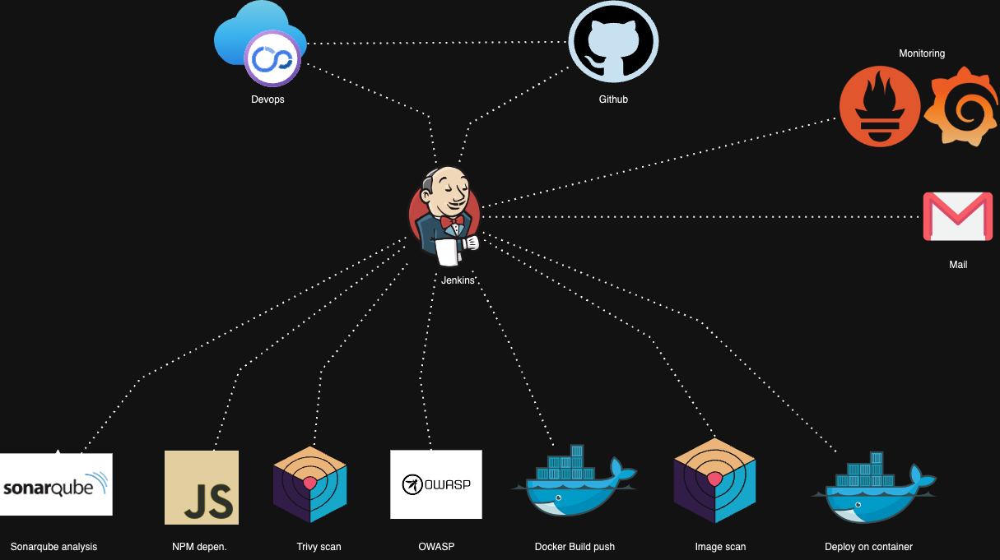
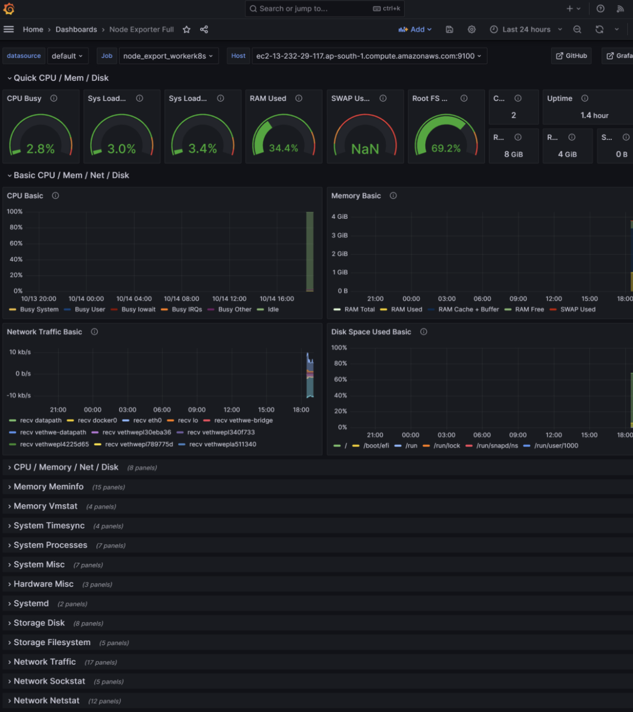
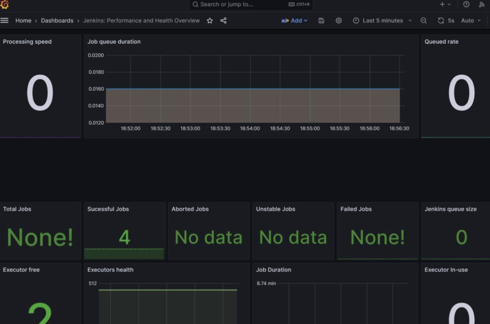
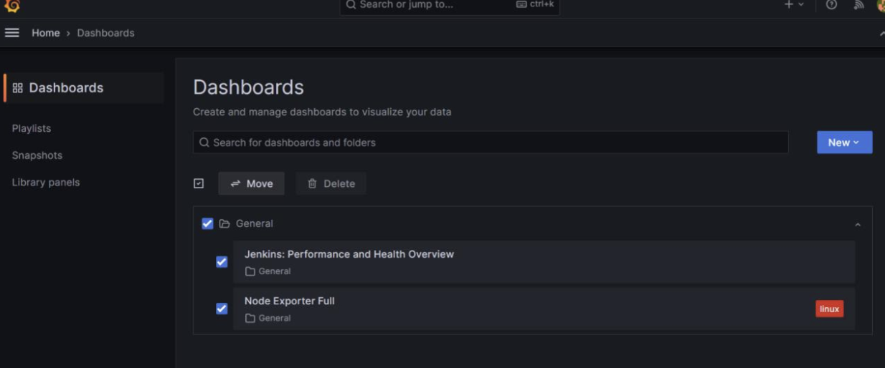
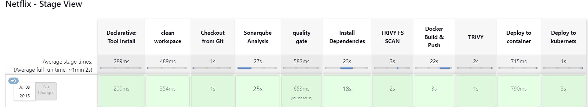

# NetflixOps




## Overview


## Tools & Plugins used
- Jenkins
- Prometheus
- Grafana
- Docker
- SonarQube
- Owasp
- Trivy scan

## Details steps

### Overview
- To get started create a ec2 instance.
- Preferably you need two instances a t2.large and a t2.micro one for monitoring and the other one for the whole pipeline.
- So in total we have 3 servers:
    - The server on which app is deployed
    - Monitoring server
    - Pipelines server
- For the app i'll be using a Netflix clone [Netflix Clone](https://github.com/vaibguptab/Netflix-clone.git) 
> [!IMPORTANT]
> Make sure you use vpn while using the api or the app as for some reason TMDB doesnt work in India.


### Run the docker-compose.yml using

```sh 
docker-compose up
```

The docker-compose file has 5 containers

 ✔ Container node-exporter         
 ✔ Container localstack  
 ✔ Container grafana     
 ✔ Container jenkins      
 ✔ Container trivy    

>**Note**: Learn more about docker-compose here: [docker-compose](https://docs.docker.com/compose/)

- Now you'll see 5 services running on your system.

## Lets configure the prometheus.yml file

- Checkout docker/prometheus.yml this will contain the config for prometheus monitoring basically all the plugins and the dependencies for prometheus.

## Configure jenkins

- Adding email service:
    - Go to your google account manager and generate a password for an app in the security section.
    - Head over to https://localhost:8080/ to jenkins and enter the password for jenkins.
>**NOTE**: sudo docker exec ${CONTAINER_ID or CONTAINER_NAME} cat /var/jenkins_home/secrets/initialAdminPassword

- Search for email extension and download it 

##  Install Plugins like JDK, Sonarqube Scanner, Nodejs, and OWASP Dependency Check

- Goto Manage Jenkins →Plugins → Available Plugins →

- Install below plugins

- 1 → Eclipse Temurin Installer (Install without restart)

- 2 → SonarQube Scanner (Install without restart)

- 3 → NodeJs Plugin (Install Without restart)

- Docker, Docker api, Docker Commons, Docker Pipelines, docker-build-step
- OWASP Dependency Check Plugin 

- Configure all the tools for Java, Nodejs, OWASP, Email, SonarQube.

- Add Global Credentials for Docker & Email using your username and passwords.

- Create a Job

- create a job as Netflix Name, select pipeline and click on ok. 

- Add the script in the Jenkins/jenkinsfile

- Read the file and modify as needed

### Now you'll see that a docker image will be created on your docker hub, now run the container to verify.

## :)










